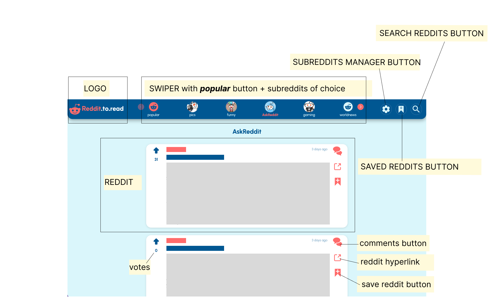

# Reddit.to.read

[Reddit.to.read](https://reddittoread.netlify.app) is a web-based application allowing user to browse posts based on subreddits from Reddit social network without having to create a Reddit account.

>[Reddit](https://www.reddit.com/) is a social media platform where users can share, discuss, and vote on content in the form of posts, links, and comments. It’s organized into subreddits, which are individual communities focused on specific topics, such as news, hobbies, entertainment, or niche interests. Each subreddit has its own rules and moderators, allowing for diverse conversations and content tailored to its subject matter.

I built this app as a required project at [Codecademy](https://www.codecademy.com/) learning platform. My goal was to create a cleaner version of Reddit, where the user can only READ the content based on their preferred subreddits.
Therefore, [Reddit JSON API](https://github.com/reddit-archive/reddit/wiki/json)
has been used to obtain data and only GET requests are executed when using Reddit.to.read app.

## Initial setup
Reddit.to.read can be found under this [LINK](https://reddittoread.netlify.app).
After opening the link , the application is ready to be used. The feed of popular reddits is displayed initially.

## App layout
The app is structured as follows:

## Features

### Subreddits management
Subreddits displayed in SWIPER can be changed depending on user`s interests. Clicking SUBREDDIT MANAGER BUTTON launches subreddit manager, where 2 page sections are present:

#### My Subreddits selection

* renders subreddit boxes
* each box includes a subreddit name, an icon (if available), a banner (if available) and 2 buttons
* left button displays a window with more details about a subreddit, such as its description or the number of subscribers
* right button removes the subreddit from My Subreddits selection, subreddit is than displaced to Explore subreddits page section
* 7 subreddits are initially preselected as default and can be removed: pics, funny, AskReddit, gaming, worldnews, aww, Music.
* SWIPER subreddits buttons in the header of the app always correspond to the subreddits in My Subreddits selection

#### Explore subreddits

* This section has a search input field to search subreddits in Reddit database based on one or more given keywords
* A rounded search-submit-button with magnifier icon only appears when the search input field is not empty
* After inputting a search query and clicking search submit button, a request is for subreddits is send and results appear below.
* Subreddit boxes in search results can be added to My Subreddits selection by clicking their plus button, located on the same place as delete button of already added subreddits

### Browsing reddit posts

Reddit posts (Reddits) for various topics show up after clicking on different subreddits on the swiper next to the app logo. 
Popular is the first navigation link on the swiper, serves to display the most popular current reddits worldwide and cannot be removed.
The next links are subreddits from My Subreddits selection and serve to render reddits of various topics accordingly.

#### Reddit

Each Reddit is composed of 3 columns. 

* The left column shows the number of votes it received from registered users on Reddit social network.
* The middle column displays 
the author of the post with a hyperlink to their profile on Reddit.com.
The relative timestamp of when the post was created.
The title of the post
The content of the post, such as text, a picture, a video or a link.
* The right column involves 3 buttons:
    - Comments section button
    - Hyperlink to the post on Reddit.com
    - Save button

### Displaying comments for a particular reddit

After clicking the comment section button in the right column of a Reddit post, a Comments window appears, with basic information about the posts and the comments. Each comments has its votes and can also have replies, which are rendered after clicking on the replies button.

### Saving reddits

Each Reddit can be saved by clicking its save button located in the right column
Those reddits are then added to Saved Reddits section of the app, accessed by the respective button on the right side of the app header.
The number within the button's icon represents the amount of currently saved Reddits.
Everytime a reddit is saved, its save button changes to a blue unsave button.

### Searching in current reddits

Everytime some reddits are displayed in the app, the search button located on the right side of the app header can be used to search those reddits.
The search bar appears after clicking the search button and accepts one or more keywords. Those keywords are analyzed only for the reddit TITLES, not for the selftext or authors.
The search button disappears everytime the subreddits manager is accessed or when the Saved reddits section is accessed without any reddits saved.

## Utilized technologies
* React JS - Reddit.to.read is a single-page react application with function components as the main building elements. React router manages the navigation and URL structures
* CSS - styles for components are written in css modules.
* JSX, HTML - to mark up the content
* Redux - used as a state management tool, primarily to fetch and store arrays of requested content such as posts, comments, subreddits, etc.
* Framer motion - for animations, such as entering and exiting items in the app, layout animations.
* Jest and Enzyme - for unit and integration tests

## License
### MIT License

Copyright (c) 2024 Tomas Ruzicka

Permission is hereby granted, free of charge, to any person obtaining a copy
of this software and associated documentation files (the "Software"), to deal
in the Software without restriction, including without limitation the rights
to use, copy, modify, merge, publish, distribute, sublicense, and/or sell
copies of the Software, and to permit persons to whom the Software is
furnished to do so, subject to the following conditions:

The above copyright notice and this permission notice shall be included in all
copies or substantial portions of the Software.

THE SOFTWARE IS PROVIDED "AS IS", WITHOUT WARRANTY OF ANY KIND, EXPRESS OR
IMPLIED, INCLUDING BUT NOT LIMITED TO THE WARRANTIES OF MERCHANTABILITY,
FITNESS FOR A PARTICULAR PURPOSE AND NONINFRINGEMENT. IN NO EVENT SHALL THE
AUTHORS OR COPYRIGHT HOLDERS BE LIABLE FOR ANY CLAIM, DAMAGES OR OTHER
LIABILITY, WHETHER IN AN ACTION OF CONTRACT, TORT OR OTHERWISE, ARISING FROM,
OUT OF OR IN CONNECTION WITH THE SOFTWARE OR THE USE OR OTHER DEALINGS IN THE
SOFTWARE.